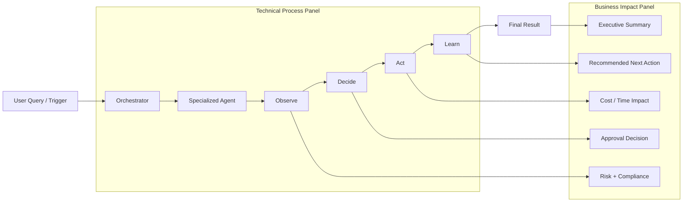

# Fullscreen Two-Panel Live Demo Plan

## 1) Feedback First (What is already strong)

You already have solid building blocks for this demo:

- A detailed real-time process execution page with cinematic styling and phase logic.
- A live agent maturity and workflow status page for business/executive visibility.
- A pipeline visualizer page with timeline-style execution and live status indicators.
- Existing route wiring and protected layout integration in the main frontend app.

This means you should not build from scratch. Reuse core parts and compose a new dedicated fullscreen presentation screen.

## 2) Existing Assets To Reuse

### Pages

- frontend/src/pages/AgentProcessPage.tsx
  - Strong for left panel process theater and execution phases.
- frontend/src/pages/AgenticFlowPage.tsx
  - Strong for business status framing and program maturity metrics.
- frontend/src/pages/PipelineVisualizerPage.tsx
  - Strong for timeline behavior, progress, and execution logs pattern.

### Components

- frontend/src/components/AgentProcessVisualizer.tsx
  - Real-time stream handling and OBSERVE -> DECIDE -> ACT -> LEARN step UX.
- frontend/src/components/AgentFlowDiagram.tsx
  - Reusable flow/diagram visual structure.
- frontend/src/components/AgentProcessMonitor.tsx
  - Monitoring-oriented display pattern.

### Routing

- frontend/src/App.tsx already includes relevant pages and protected routing patterns.

## 3) Recommendation

Build one new dedicated page for the client presentation:

- Name suggestion: frontend/src/pages/ExecutiveLiveDemoPage.tsx
- Keep fullscreen (100vh), no side navigation distractions.
- Use a 2-column layout:
  - Left: technical live process animation (agent phases, routing, confidence, timing).
  - Right: non-technical business feed (what happened, why it matters, approval risk, ROI impact).

Reuse existing process visual logic from AgentProcessPage/AgentProcessVisualizer, and add a new right-side narrative panel that translates technical events to executive language.

## 4) Two-Panel Architecture Diagram

## 5) UI Plan (Presentation-Ready)

### Top Bar (Full Width)

- Title: AI Procurement Live Decision Theater
- Live badge + environment badge (Demo / Live)
- Session timer
- Controls:
  - Play/Pause simulation
  - Slow/Normal/Fast speed
  - Reset
  - Fullscreen toggle

### Left Panel (Technical Story)

- Visual step timeline with animated transitions for each phase.
- Agent cards showing selected agent, confidence, tool calls, and duration.
- Event log strip with color-coded state (info, warning, success).
- Optional mini architecture map to show current node highlight.

### Right Panel (Business Story)

- Plain-language current status card.
- Decision card:
  - Approved / Escalated / Rejected
  - Confidence and reason in non-technical terms.
- Risk and compliance card (traffic-light style).
- Financial impact card:
  - Budget remaining
  - Potential savings
  - Time saved
- Recommended action card with one clear next step.

## 6) Data Strategy

Support two modes:

- Live mode:
  - Subscribe to actual stream/events from backend endpoints.
- Demo mode:
  - Use scripted timeline payloads so presentation is deterministic.

Use a small adapter layer to normalize incoming events:

- Input: raw agent events/steps.
- Output:
  - leftPanelState (technical)
  - rightPanelNarrative (business wording)

## 7) Implementation Phases

### Phase 1: Composition Skeleton

- Create new fullscreen page layout.
- Add top bar, left panel container, right panel container.
- Add route entry in frontend/src/App.tsx.

### Phase 2: Left Panel Reuse

- Reuse/refactor logic from AgentProcessVisualizer.
- Extract reusable hook or state mapper for phase updates.
- Add polished animation timing controls.

### Phase 3: Right Panel Narrative Engine

- Build mapping from technical events to executive-friendly messages.
- Add cards for decision, risk, finance, and next action.

### Phase 4: Demo Timeline + Reliability

- Add deterministic mock timeline presets (Budget, Risk, Vendor, Approval scenarios).
- Add safe fallback UI when stream disconnects.
- Add loading and empty states.

### Phase 5: Final Polish

- Typography, spacing, and transition refinements.
- Mobile fallback behavior and responsive handling.
- Quick QA checklist for presentation confidence.

## 8) Risks and Mitigations

- Risk: Event stream payload variations.
  - Mitigation: strict adapter and schema guards.
- Risk: Too technical for business audience.
  - Mitigation: right panel always renders plain-language narrative.
- Risk: Live demo instability.
  - Mitigation: one-click deterministic demo mode.

## 9) Definition of Done

- Fullscreen two-panel page runs end-to-end.
- Left side shows live technical process with clear phase progression.
- Right side shows understandable business impact in real time.
- Demo mode can run without backend instability.
- Navigation route is available and protected like existing pages.

## 10) Suggested Next Step

After approval, implement only Phase 1 to Phase 2 first (layout + left panel reuse), then review visually before building the right-panel narrative engine.
